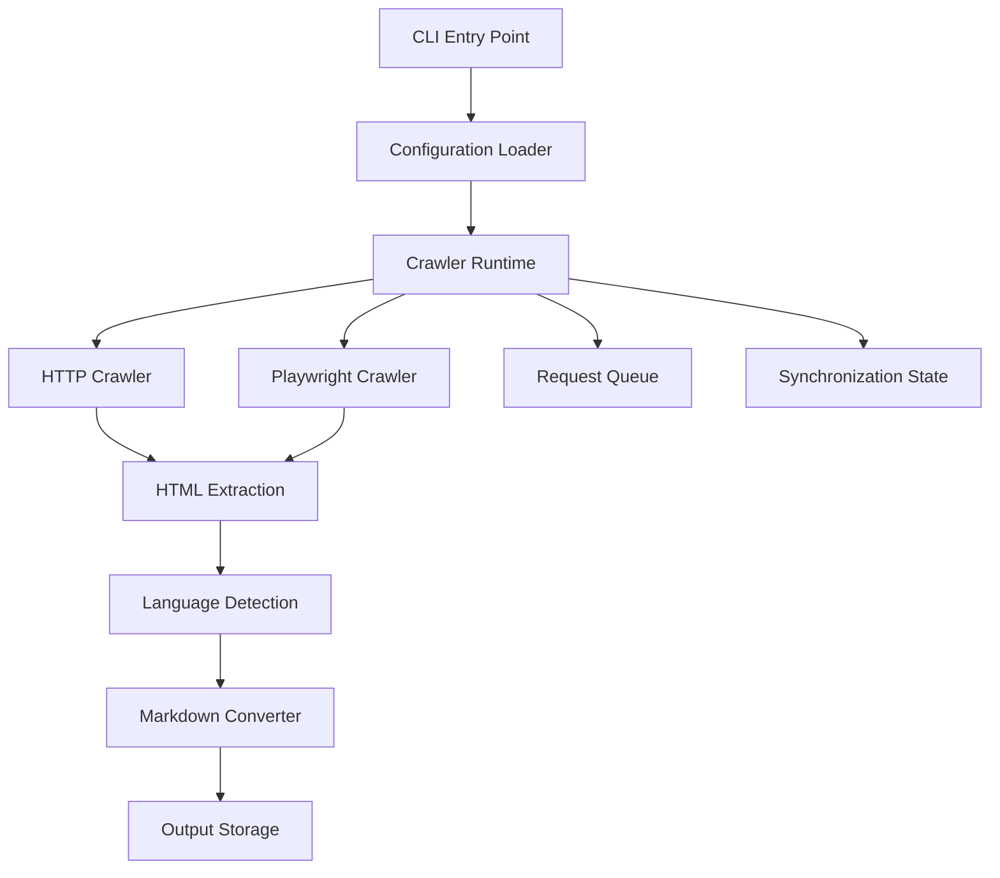

# docsync

A documentation crawling and synchronization engine built with Python, Crawlee, Playwright, and uv.

docsync crawls documentation websites, extracts clean Markdown content, and maintains incremental synchronization state.

It is designed for:

- Documentation backups
- Offline documentation archives
- AI dataset preparation
- Knowledge base generation
- Internal documentation mirrors
- Automated documentation synchronization

---

## Features

| Feature | Support |
|---|---|
| Python | 3.13+ |
| Crawlee Python | 1.9.1 |
| HTTP crawling | Yes |
| Playwright crawling | Yes |
| BeautifulSoup extraction | Yes |
| Chromium support | Yes |
| Firefox support | Yes |
| WebKit support | Yes |
| Sitemap discovery | Yes |
| Incremental synchronization | Yes |
| Request rate limiting | Yes |
| Concurrency control | Yes |
| Markdown conversion | Yes |
| Language-aware crawling | Yes |
| CLI application | Yes |

---

# Architecture



---

# Installation

## Requirements

Before installation:

- Git
- Python 3.13+
- uv package manager

---

## Install uv

### Linux / macOS

```bash
curl -LsSf https://astral.sh/uv/install.sh | sh
```

### Windows PowerShell

```powershell
powershell -c "irm https://astral.sh/uv/install.ps1 | iex"
```

Verify:

```bash
uv --version
```

---

# Install docsync from GitHub

Clone repository:

```bash
git clone https://github.com/USERNAME/docsync.git
cd docsync
```

Install project:

```bash
uv sync
```

This automatically installs:

- docsync dependencies
- Crawlee Python
- BeautifulSoup crawler support
- Playwright crawler support
- curl impersonation support
- Required Python packages

---

# Crawlee Installation

docsync uses Crawlee for Python as the crawling engine.

No separate Crawlee application is required.

Crawlee is installed automatically with:

```bash
uv sync
```

Verify:

```bash
uv run python -c "import crawlee; print(crawlee.__version__)"
```

Expected:

```text
1.9.1
```

---

# Playwright Browser Installation

Playwright browser binaries are installed separately.

For Chromium:

```bash
uv run playwright install chromium
```

Supported browsers:

- Chromium
- Firefox
- WebKit

---

# Verify Installation

Run:

```bash
uv run docsync --help
```

If the CLI help appears, installation is complete.

---

# Quick Start

## HTTP Crawl

For static documentation:

```bash
uv run docsync https://example.com/docs
```

---

## Playwright Crawl

For JavaScript-rendered websites:

```bash
uv run docsync \
  https://example.com/docs \
  --mode playwright \
  --browser-type chromium
```

---

# Crawler Modes

## HTTP Mode

Fast crawling mode for static websites.

```bash
uv run docsync URL --mode http
```

---

## Playwright Mode

Browser automation mode for JavaScript applications.

```bash
uv run docsync URL \
  --mode playwright \
  --browser-type chromium
```

---

# Language Support

Supported languages:

| Language | Code |
|---|---|
| English | `en` |
| Turkish | `tr` |

Example:

```bash
uv run docsync \
  https://example.com/docs \
  --language tr
```

---

# CLI Configuration

| Option | Description |
|---|---|
| `--output-dir` | Markdown output directory |
| `--state-dir` | Synchronization state directory |
| `--max-concurrency` | Maximum parallel requests |
| `--max-requests` | Request limit |
| `--requests-per-minute` | Rate limit |
| `--language` | Target language |
| `--refresh-hours` | Refresh interval |
| `--mode` | HTTP or Playwright |
| `--browser-type` | Browser engine |

Example:

```bash
uv run docsync \
  https://example.com/docs \
  --output-dir ./output \
  --state-dir ./storage \
  --max-concurrency 4 \
  --max-requests 5000 \
  --requests-per-minute 60 \
  --language en \
  --mode playwright \
  --browser-type chromium
```

---

# Project Structure

```text
docsync/

├── src/
│   └── docsync/
│       ├── cli.py
│       ├── crawler.py
│       ├── crawler_runtime.py
│       ├── config.py
│       ├── inventory.py
│       ├── language.py
│       ├── sitemap.py
│       └── models.py
│
├── tests/
│
├── output/
│
├── storage/
│
├── pyproject.toml
│
└── uv.lock
```

---

# Output Structure

Generated Markdown:

```text
output/

└── pages/
    ├── index.md
    ├── getting-started.md
    └── api-reference.md
```

Synchronization data:

```text
storage/
```

The state directory keeps crawl progress and synchronization metadata.

---

# Development

Install development environment:

```bash
uv sync
```

Run tests:

```bash
uv run pytest -q
```

Format:

```bash
uv run ruff format .
```

Lint:

```bash
uv run ruff check .
```

Type checking:

```bash
uv run mypy .
```

---

# Build Release Package

Build package:

```bash
uv build
```

Install locally:

```bash
uv tool install .
```

Verify:

```bash
docsync --help
```

---

# Global CLI Installation

After publishing a GitHub Release:

```bash
uv tool install docsync
```

Then docsync can run from any directory:

```bash
docsync https://example.com/docs
```

No project folder is required after installation.

---

# Technology Stack

| Technology | Purpose |
|---|---|
| Python | Application runtime |
| Crawlee | Web crawling engine |
| Playwright | Browser automation |
| BeautifulSoup | HTML parsing |
| Pydantic | Data validation |
| uv | Dependency management |
| Ruff | Code quality |
| MyPy | Static typing |
| Pytest | Testing |

---

# License

MIT License
